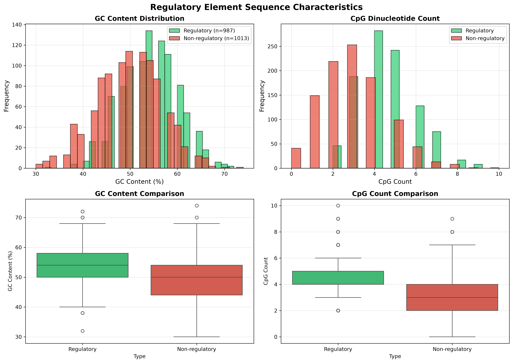
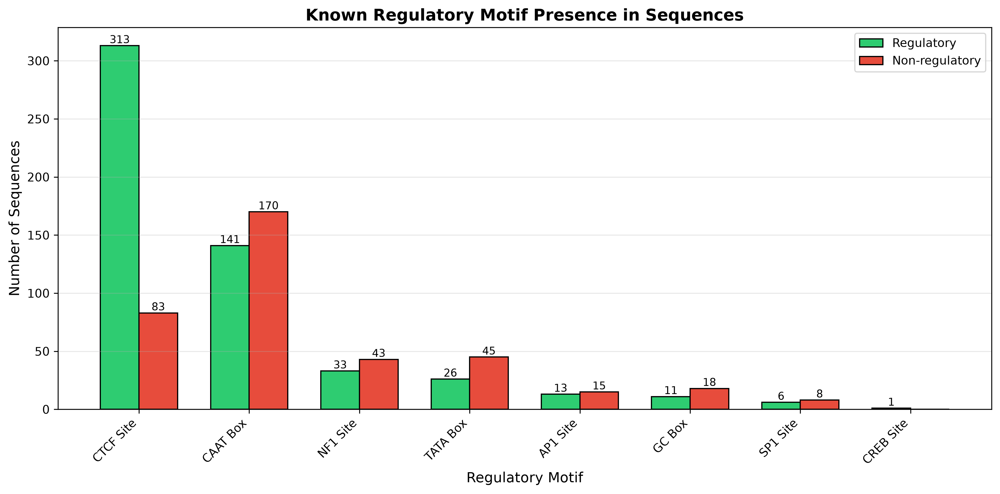
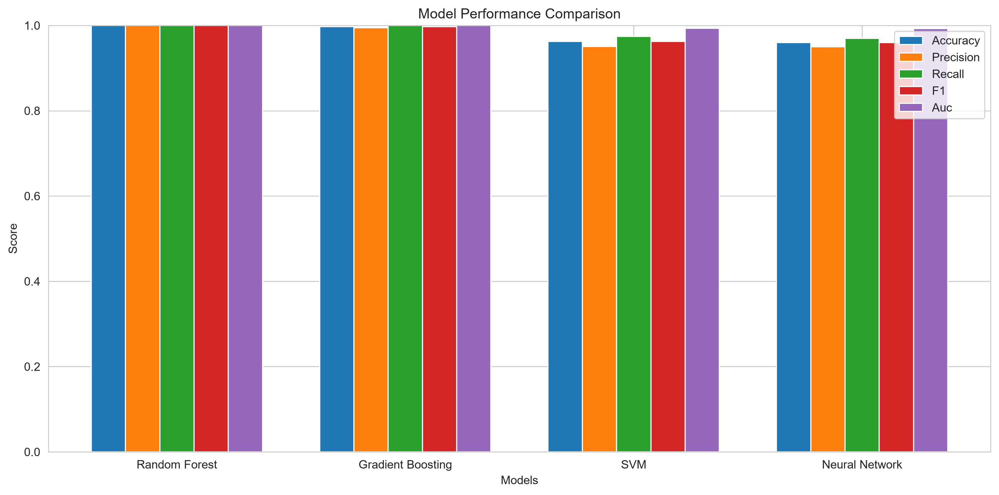
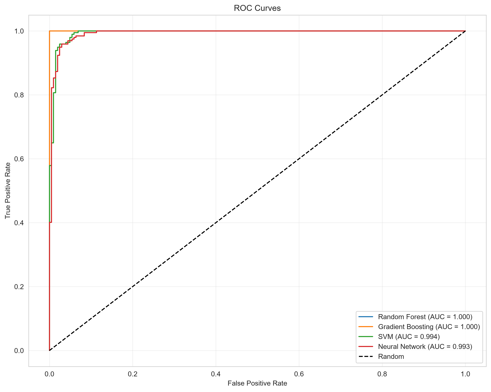
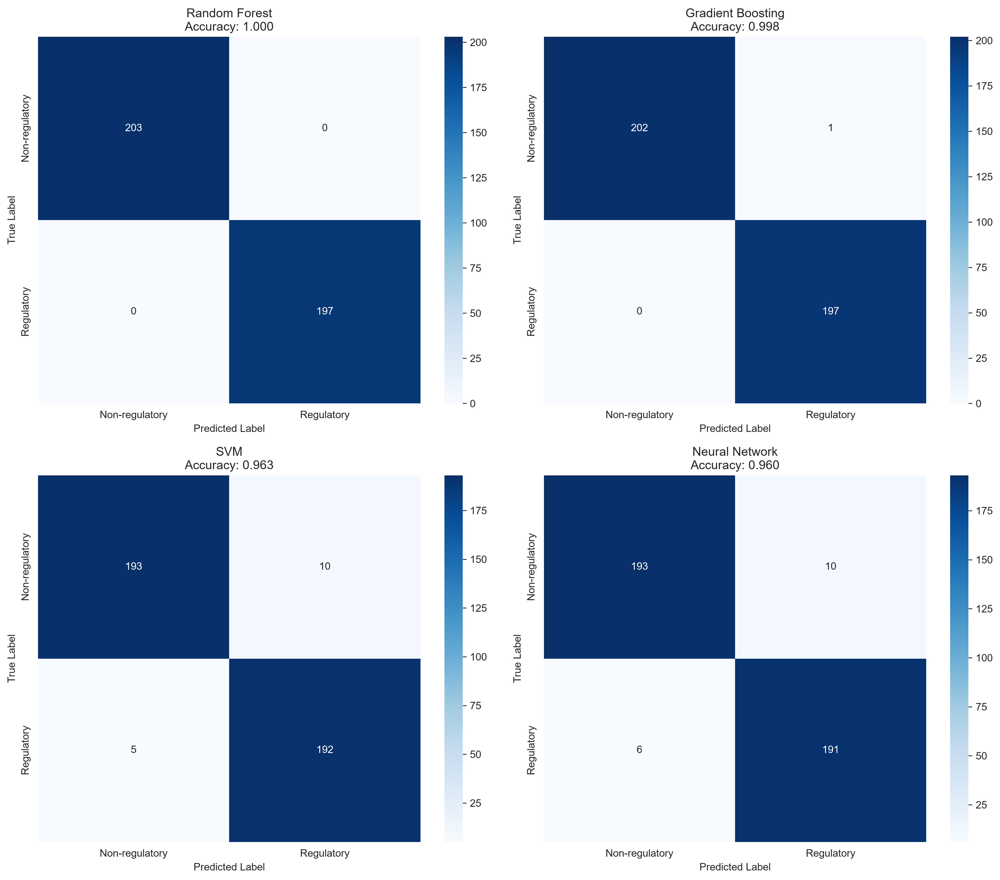
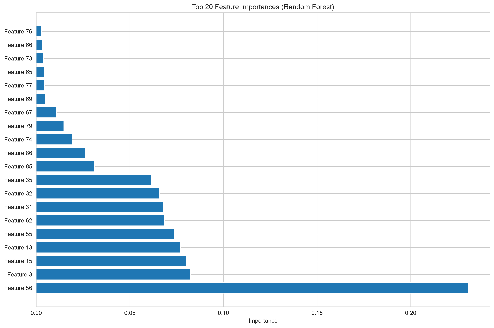

# Regulatory Element Identification in Genomic Sequences

A comprehensive machine learning project for identifying regulatory elements (promoters, enhancers, silencers, insulators) in DNA sequences using both Python and R implementations.

## 📋 Table of Contents

- [Overview](#overview)
- [Regulatory Elements](#regulatory-elements)
- [Project Structure](#project-structure)
- [Installation](#installation)
- [Usage](#usage)
- [Features](#features)
- [Results](#results)
- [Visualizations](#visualizations)
- [Dataset License](#dataset-license)
- [Contributing](#contributing)
- [License](#license)

## 🎯 Overview

This project provides tools to identify regulatory elements in genomic DNA sequences using machine learning approaches. Regulatory elements are crucial DNA sequences that control gene expression, and their accurate identification is essential for understanding gene regulation, disease mechanisms, and developing therapeutic interventions.

### What Sequences Encode Regulatory Elements?

Regulatory elements are characterized by specific sequence patterns and features:

1. **Promoters**:
   - Located upstream of genes (typically 100-1000 bp from transcription start site)
   - Contain conserved motifs: TATA box (TATAAA), CAAT box (CCAAT), GC box (GGGCGG)
   - Initiator element (Inr): YYANWYY pattern
   - Downstream promoter element (DPE)
   - Specific nucleotide composition patterns

2. **Enhancers**:
   - Can be located far from genes (up to 1 Mb away)
   - Work in either orientation
   - Contain clusters of transcription factor binding sites
   - Often have high GC content
   - Characteristic chromatin accessibility patterns

3. **Silencers**:
   - Similar structural features to enhancers
   - Contain repressor binding sites
   - Often located in gene regulatory regions
   - May have specific sequence motifs for repressor proteins

4. **Insulators**:
   - Create boundaries between regulatory domains
   - Contain CTCF binding sites (CCCTC-binding factor)
   - Specific sequence patterns that block enhancer-promoter interactions
   - Often located between genes or regulatory regions

## 📁 Project Structure

```
Regulatory Element Identification/
│
├── data/
│   └── genomics_data.csv          # Input dataset
│
├── src/
│   └── regulatory_element_identification.py  # Python implementation
│
├── scripts/
│   ├── regulatory_element_identification.R    # R script implementation
│   └── regulatory_element_identification.Rmd  # R Markdown notebook
│
├── notebooks/
│   └── regulatory_element_identification.ipynb  # Jupyter notebook
│
├── results/
│   ├── model_comparison.png        # Model performance comparison
│   ├── roc_curves.png             # ROC curves for all models
│   ├── confusion_matrices.png     # Confusion matrices
│   └── feature_importance.png     # Feature importance analysis
│
├── docs/
│   └── (documentation files)
│
├── requirements.txt               # Python dependencies
├── environment.yml                # Conda environment file
├── .gitignore                     # Git ignore file
└── README.md                      # This file
```

## 🚀 Installation

### Python Environment

#### Using pip:
```bash
pip install -r requirements.txt
```

#### Using conda:
```bash
conda env create -f environment.yml
conda activate regulatory-element-identification
```

### R Environment

Install required R packages:
```r
install.packages(c("dplyr", "caret", "randomForest", "e1071", 
                   "pROC", "ggplot2", "gridExtra", "stringr"))
```

## 💻 Usage

### Python Implementation

#### Command Line:
```bash
python src/regulatory_element_identification.py
```

#### Jupyter Notebook:
```bash
jupyter notebook notebooks/regulatory_element_identification.ipynb
```

#### Python Script Usage:
```python
from src.regulatory_element_identification import RegulatoryElementIdentifier

# Initialize
identifier = RegulatoryElementIdentifier('data/genomics_data.csv')

# Load and prepare data
identifier.load_data()
identifier.prepare_features(k=3)
identifier.split_data(test_size=0.2)

# Train models
identifier.train_models()

# Evaluate
results = identifier.evaluate_models()

# Generate visualizations
identifier.plot_results(results, save_path='results')

# Predict on new sequences
new_sequences = ['GTCCACGACCGAACTCCCACCTTGACCGCAGAGGTACCACCAGAGCCCTG']
predictions, probabilities = identifier.identify_regulatory_elements(
    new_sequences, 
    model_name='Random Forest'
)
```

### R Implementation

#### R Script:
```r
source("scripts/regulatory_element_identification.R")
result <- main()
```

#### R Markdown:
```r
# Open in RStudio and knit, or use:
rmarkdown::render("scripts/regulatory_element_identification.Rmd")
```

## 🔬 Features

### Feature Extraction

The project extracts multiple types of features from DNA sequences:

1. **K-mer Features**: 
   - Frequency of all possible k-mers (default: 3-mers/trinucleotides)
   - Captures local sequence patterns characteristic of regulatory elements
   - Normalized by sequence length

2. **Composition Features**:
   - Nucleotide frequencies (A, T, G, C)
   - GC content
   - AT/GC ratio
   - Dinucleotide frequencies (16 dinucleotides)
   - Sequence complexity (Shannon entropy)

3. **Motif Features**:
   - TATA box (TATAAA)
   - TATA box variants
   - CAAT box (CCAAT)
   - GC box (GGGCGG)
   - Other known regulatory motifs

### Machine Learning Models

The project implements and compares multiple ML models:

1. **Random Forest**: Ensemble method with feature importance analysis
2. **Gradient Boosting**: Sequential ensemble learning
3. **Support Vector Machine (SVM)**: Kernel-based classification
4. **Neural Network (MLP)**: Multi-layer perceptron

### Evaluation Metrics

- Accuracy
- Precision
- Recall
- F1-Score
- AUC-ROC (Area Under the ROC Curve)

## 📊 Results

The analysis generates several visualizations:

1. **Model Comparison**: Bar chart comparing all models across different metrics
2. **ROC Curves**: Receiver Operating Characteristic curves for all models
3. **Confusion Matrices**: Detailed classification performance for each model
4. **Feature Importance**: Top features contributing to regulatory element identification

Results are automatically saved in the `results/` directory.

## Visualizations

### Sequence composition & motif enrichment





### Model evaluation

**Performance comparison**



**ROC curves**



**Confusion matrices**



**Feature importance**



Showcase images are stored in `docs/images/`. Run `src/regulatory_element_identification.py` or `scripts/python/visualize_regulatory_elements.py` to regenerate under `results/`.

## 📄 Dataset License

### Original Dataset

The `genomics_data.csv` dataset used in this project contains DNA sequences and their regulatory element labels. 

**Important**: This dataset appears to be a synthetic or processed dataset for machine learning purposes. The original source and license should be verified.

**If you are the dataset creator or know the original source**, please note:

- The dataset should be properly attributed
- Any specific license terms should be respected
- Users should comply with data usage restrictions

**For users of this project**:

- If using this dataset for research, please cite the original source
- Verify the dataset license before commercial use
- Ensure compliance with any data sharing agreements

**Recommended Citation Format** (if known):
```
[Dataset Name]. [Creator/Institution]. [Year]. 
Available at: [URL/Repository]
License: [License Type]
```

If the original dataset license is unknown, users should:
1. Contact the dataset provider for license information
2. Use the dataset only for educational/research purposes
3. Not redistribute the dataset without permission

## 🤝 Contributing

Contributions are welcome! Please feel free to submit a Pull Request. For major changes, please open an issue first to discuss what you would like to change.

### Contribution Guidelines

1. Fork the repository
2. Create a feature branch (`git checkout -b feature/AmazingFeature`)
3. Commit your changes (`git commit -m 'Add some AmazingFeature'`)
4. Push to the branch (`git push origin feature/AmazingFeature`)
5. Open a Pull Request

## 📝 License

This project is provided as-is for educational and research purposes. Please refer to the dataset license section above for information about the data used in this project.

## 🙏 Acknowledgments

- Machine learning libraries: scikit-learn, caret
- Visualization libraries: matplotlib, seaborn, ggplot2
- Bioinformatics community for regulatory element research

## 📧 Contact

For questions or issues, please open an issue on the GitHub repository.

---

**Note**: This project is designed for educational and research purposes. Always verify results with experimental validation in biological contexts.

**Last Updated**: June 2024
